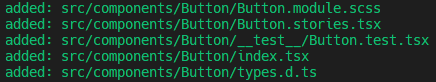

# React Hygen Template
This is a template for [Hygen](https://www.hygen.io/) to generate React components.

## Installation
Install **Hygen** and **Hygen Add** globally:
```shell
$ npm install -g hygen hygen-add
```

Install the template:
```shell
$ hygen-add https://github.com/e-azocar/react-hygen-template
```

## Usage
Generate a component:
```shell
$ hygen component new --name NAME [--tsx] [--state] [--scss]
```
- **NAME**: Component name. (**Required**)
- **--tsx**: Generate a typescript component. (**Optional**)
- **--state**: Generate a component with useState hook. (**Optional**)
- **--scss**: Generate a component with scss file. (**Optional**)

*If no flags given, will generate a React functional component.*


### Example
```shell
$ hygen component new --name Button --tsx --state --scss
```

